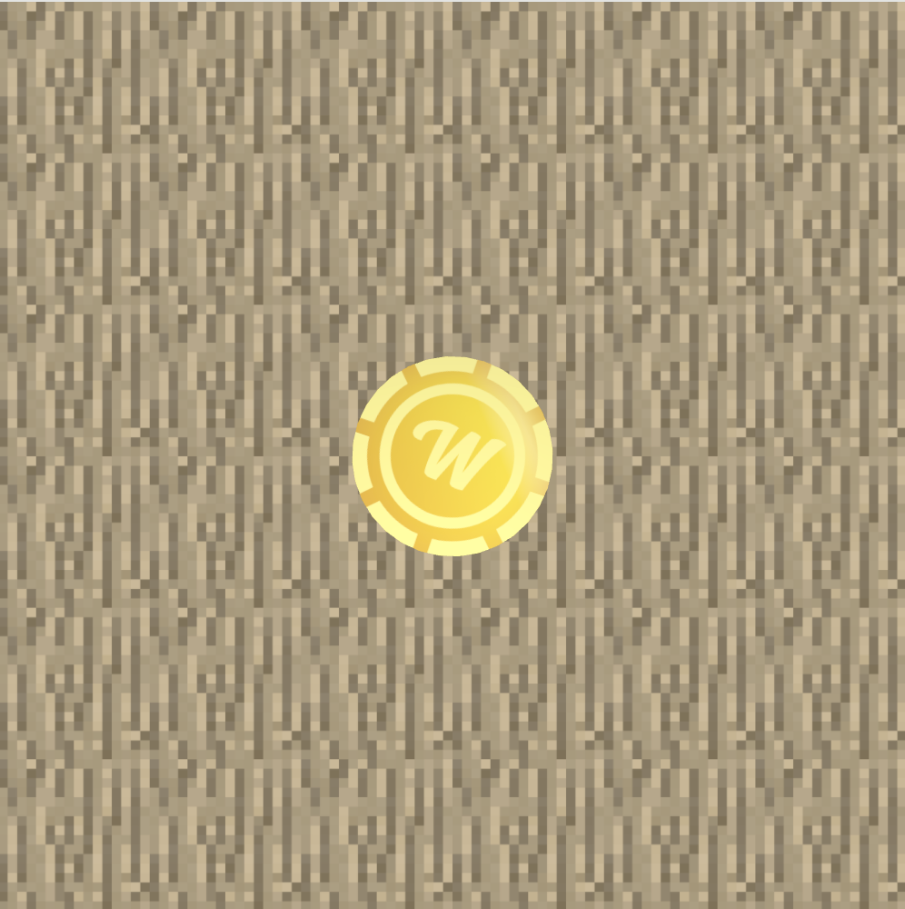

## Coin flip game



To start the app locally in dev mode, do:

```bash
yarn install
yarn dev
```

This app is built using Three.js library. I decided to not use the React wrapper for Three.js with the following in ming:

- It's my first experience with Three.js and I wanted to get familiar with the fundamentals as much as possible

- Integrating "non-react" code inside a React app and making it look clean is a cool little challenge on its own

- As mush as wrappers and abstractions can make things simpler, they also sometimes come with limitations. Given it's my first Three.js experience and I had limited time, I didn't want to risk finding out that the React Three.js abstraction has weird restriction at the end of fifth our of working on the task.

- Given how simple our app is, not going with the React wrapper is generally not a big deal
